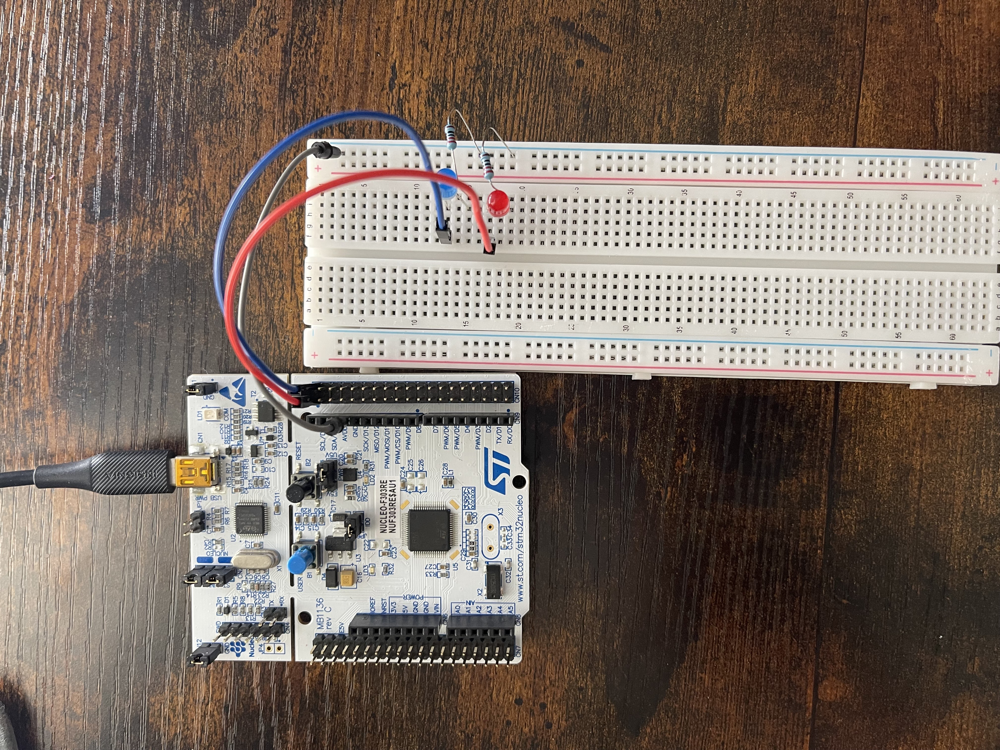

# STM32 Nucleo LED Controller

This project blinks two external LEDs connected to PC8 and PC9 using register-level programming on an STM32F303RE Nucleo board. All GPIO configuration and delay logic is implemented manually, without using STM32 HAL or Cube libraries.

## 🔧 Hardware

- STM32F303RE Nucleo board  
- Breadboard  
- 2x LEDs  
- 2x 220Ω resistors  
- Jumper wires

### Circuit:
- PC8 → Resistor → LED Anode → Cathode → GND  
- PC9 → Resistor → LED Anode → Cathode → GND  

<p align="center">
  
</p>

## ⚙️ Implementation Details

- GPIO pins PC8 and PC9 configured as output via CMSIS macros:
  - `GPIO_MODER_MODER8_0`, `GPIO_MODER_MODER9_0`
- Output type set to push-pull, no pull-up/down resistors, low speed
- Used SysTick timer to generate 1ms interrupts
- `Delay()` function built around a `volatile` counter decremented in `SysTick_Handler`
- LED toggle logic handled with:
  - `GPIOC->BSRR` to set pin HIGH  
  - `GPIOC->BRR` to set pin LOW

### 💡 LED Blinking Demo

[](https://youtube.com/shorts/cPPfdc07ZzA?feature=share)

## 🖥️ Example `main.c` Snippet

```c
GPIOC->MODER &= ~(GPIO_MODER_MODER8 | GPIO_MODER_MODER9);
GPIOC->MODER |=  GPIO_MODER_MODER8_0 | GPIO_MODER_MODER9_0;

GPIOC->OTYPER &= ~(GPIO_OTYPER_OT_8 | GPIO_OTYPER_OT_9);
GPIOC->OSPEEDR &= ~(GPIO_OSPEEDER_OSPEEDR8 | GPIO_OSPEEDER_OSPEEDR9);
GPIOC->PUPDR &= ~(GPIO_PUPDR_PUPDR8 | GPIO_PUPDR_PUPDR9);

// In loop
GPIOC->BSRR |= (GPIO_BSRR_BS_8 | GPIO_BSRR_BS_9);
Delay(1000);
GPIOC->BRR  |= (GPIO_BRR_BR_8 | GPIO_BRR_BR_9);
Delay(1000);

